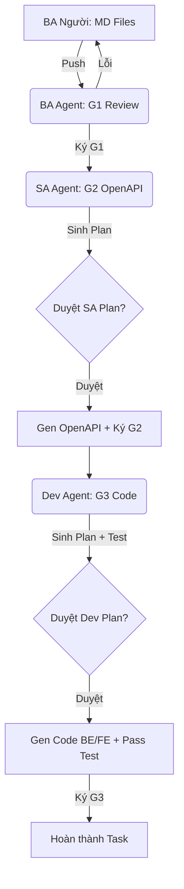

# Quy trình 3 Bước: BA (Review) -> SA (OpenAPI) -> Dev (Code)

Mọi công việc đều phải tuân thủ cơ chế **"Kế hoạch trước - Hành động sau" (Plan-First)** và **"Viết Test trước - Code sau" (TDD)**.

## Tổng quan luồng công việc



---

## GIAI ĐOẠN 1 — BA (Review Đặc tả)

**Đầu vào**: Các file đặc tả `.md` do BA (con người) viết trong thư mục `features/`.

**BA Agent thực hiện**:

- Kiểm tra tính đầy đủ: Phải có mô tả luồng, các trạng thái, và danh sách quy tắc nghiệp vụ (Business Rules).
- Kiểm tra logic: Phát hiện các mâu thuẫn giữa các file MD.
- **Kết quả**:
  E --> F(Dev Agent: G3 Code)
  F -->|Sinh Plan + Test| G{Duyệt Dev Plan?}
  G -->|Duyệt| H[Gen Code Root BE/FE + Pass Test]
  H -->|Ký G3| I[Hoàn thành Task]

  ```

  ---

  ## GIAI ĐOẠN 2 — SA (Thiết kế Contract)

  **Đầu vào**: Gate G1 và Database Schema hiện có (mô tả trong `docs/ARCHITECTURE.md`).

  **SA Agent thực hiện**:
  1. **Lập kế hoạch**: Sinh file `../../gates/SA-Plan.md`.
  2. **Dừng lại**: Chờ con người kiểm tra Plan.
  3. **Thực thi**: Sau khi được duyệt, sinh file `OpenAPI.yaml` trong `../../contracts/`.
  4. **Ký duyệt**: Ký duyệt `../../gates/G2-sa-signoff.md`.

  ---

  ## GIAI ĐOẠN 3 — Dev (Lập trình & TDD)

  **Đầu vào**: Gate G2 và đặc tả MD từ G1.

  **Dev Agent thực hiện**:
  1. **Lập kế hoạch & Viết Test (TDD)**:
  - Sinh file `../../gates/Dev-Plan.md`.
  2. **Dừng lại**: Chờ con người kiểm tra Plan/Test.
  3. **Thực thi**:
  - Sinh mã nguồn BE (`../../backend/`) và FE (`../../frontend/`).
  - Chạy test local (`mvn test` / `npm test`).
  4. **Ký duyệt**: Ký duyệt `../../gates/G3-dev-signoff.md`.
  ```

## Quy tắc "Trói chân AI" (AI Constraint)

1. **Không nhảy bước**: Không được viết code/contract khi chưa có Plan được con người duyệt bằng chữ "Duyệt".
2. **TDD tuyệt đối**: AI tự code tự test sẽ gây thiên vị. Con người duyệt kịch bản test trước khi AI viết logic code.
3. **Mọi thay đổi qua Git**: Mọi trao đổi và phê duyệt đều phải thể hiện qua các file trong thư mục `gates/`.
